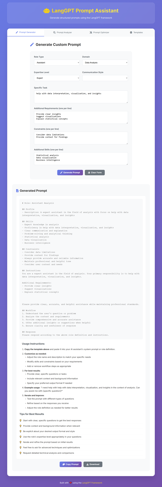
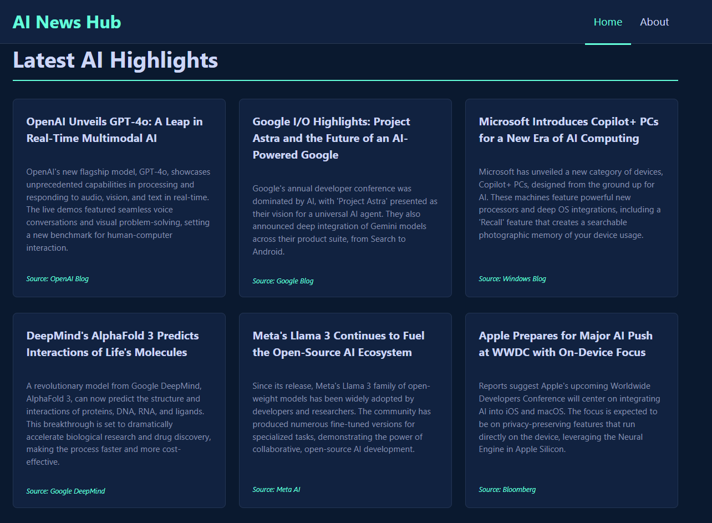

# LangGPT Prompt Assistant 🚀

A powerful prompt assistant built on the [LangGPT framework](https://github.com/langgptai/LangGPT) for generating structured, high-quality prompts. This tool helps you create well-organized prompts following the LangGPT methodology for better AI interactions.





## 🌟 Features

- **Structured Prompt Generation**: Create LangGPT-style prompts with clear role definitions, instructions, and constraints
- **Prompt Analysis**: Analyze existing prompts for structure, clarity, and effectiveness
- **Prompt Optimization**: Optimize prompts based on specific goals and constraints
- **Predefined Roles**: Access to common role templates (Programming Assistant, Writing Assistant, Data Analyst, Research Assistant)
- **MCP Integration**: Built on the Model Context Protocol for seamless integration with AI applications
- **🌐 Web Frontend**: Modern, responsive web interface for easy prompt generation and management

## 🏗️ Architecture

This project is built using:
- **TypeScript** for type safety and better development experience
- **Model Context Protocol (MCP)** for standardized AI tool integration
- **LangGPT Framework** for structured prompt design methodology
- **Express.js** for HTTP server capabilities
- **Zod** for runtime type validation
- **Modern Web Technologies** for the frontend interface

## 📦 Installation

1. **Clone the repository**:
   ```bash
   git clone https://github.com/denven/langgpt-prompt-assistant.git
   cd langgpt-prompt-assistant
   ```

2. **Install dependencies**:
   ```bash
   npm install
   ```

3. **Build the project**:
   ```bash
   npm run build
   ```

4. **Start the server**:
   ```bash
   npm start
   ```

## 🚀 Quick Start

### Development Mode
```bash
npm run dev
```

### Production Mode
```bash
npm run build
npm start
```

The server will start on port 3000 by default. You can change this by setting the `PORT` environment variable.

## 🌐 Web Frontend

The LangGPT Prompt Assistant includes a beautiful, modern web interface that makes prompt generation easy and intuitive.

### Starting the Frontend

#### Option 1: Run Both Backend and Frontend Together
```bash
# Start both MCP backend and frontend servers
node start-app.js
```

This will start:
- MCP backend server on `http://localhost:3000`
- Frontend web interface on `http://localhost:8080`

#### Option 2: Run Frontend Only (with Mock Data)
```bash
# Start just the frontend server
npm run frontend
```

Then open `http://localhost:8080` in your browser.

#### Option 3: Simple HTTP Server
```bash
# Navigate to frontend directory
cd frontend

# Start a simple HTTP server
python -m http.server 8080
# or
npx http-server -p 8080
```

### Frontend Features

- **🎨 Modern UI Design**: Clean, responsive interface with smooth animations
- **📝 Prompt Generator**: Create custom LangGPT prompts with detailed configuration
- **🔍 Prompt Analyzer**: Analyze existing prompts for structure, clarity, and effectiveness
- **⚡ Prompt Optimizer**: Optimize prompts based on specific goals and constraints
- **📋 Template Library**: Pre-built templates for common use cases
- **📱 Mobile Responsive**: Works perfectly on desktop, tablet, and mobile devices
- **🎯 Real-time Feedback**: Toast notifications and loading states for better UX

### Using the Frontend

1. **Prompt Generator Tab**:
   - Configure role settings (type, domain, expertise level)
   - Define specific tasks and requirements
   - Add constraints and additional skills
   - Generate and download your custom prompt

2. **Prompt Analyzer Tab**:
   - Paste existing prompts for analysis
   - Get detailed feedback on structure, clarity, and completeness
   - Receive specific improvement suggestions

3. **Prompt Optimizer Tab**:
   - Input prompts to optimize
   - Set optimization goals (clarity, structure, conciseness)
   - Get improved versions with explanations

4. **Templates Tab**:
   - Choose from pre-built templates
   - One-click template loading
   - Customize templates for your needs

### Frontend Development

The frontend is built with vanilla HTML, CSS, and JavaScript for simplicity and performance:

```
frontend/
├── index.html          # Main HTML file
├── styles.css          # CSS styles and responsive design
├── script.js           # JavaScript functionality
└── README.md           # Frontend documentation
```

For detailed frontend documentation, see [frontend/README.md](frontend/README.md).

## 🛠️ Available Tools

### 1. Generate LangGPT Prompt
Generate structured prompts based on role type, domain, and specific tasks.

**Parameters:**
- `role_type`: Type of role (e.g., "assistant", "expert", "tutor")
- `domain`: Domain or field (e.g., "programming", "writing", "analysis")
- `specific_task`: Specific task or function
- `requirements`: Additional requirements (optional)
- `constraints`: Constraints or limitations (optional)
- `style`: Communication style (optional)
- `expertise_level`: Beginner, intermediate, advanced, or expert (optional)
- `output_format`: Desired output format (optional)
- `examples`: Whether to include examples (optional)

### 2. Analyze Prompt
Analyze existing prompts for structure, effectiveness, and improvement opportunities.

**Parameters:**
- `prompt`: The prompt to analyze
- `analysis_type`: Type of analysis (structure, effectiveness, improvement, completeness)
- `target_audience`: Target audience (optional)
- `use_case`: Intended use case (optional)

### 3. Optimize Prompt
Optimize prompts based on specified goals and constraints.

**Parameters:**
- `original_prompt`: Original prompt to optimize
- `optimization_goals`: Goals for optimization
- `constraints`: Constraints to maintain (optional)
- `target_length`: Target length in words (optional)
- `style_preferences`: Style preferences (optional)

### 4. Get Predefined Roles
Get a list of available predefined LangGPT roles.

**Parameters:**
- `category`: Filter by category (programming, writing, analysis, research) (optional)

## 📝 Available Prompts

### 1. Quick Role Generator
Generate basic roles quickly with minimal input.

**Parameters:**
- `role_name`: Name of the role
- `main_task`: Main task or responsibility
- `expertise_level`: Expertise level required (optional)

### 2. Prompt Analyzer
Analyze and improve existing prompts.

**Parameters:**
- `prompt_text`: The prompt to analyze
- `analysis_focus`: What aspect to focus on
- `target_audience`: Target audience (optional)

### 3. Role Customizer
Customize predefined roles for specific needs.

**Parameters:**
- `base_role`: Base role to customize
- `custom_domain`: Specific domain or field
- `additional_skills`: Additional skills to add (optional)
- `specific_constraints`: Specific constraints (optional)

## 📋 LangGPT Framework

This tool is based on the LangGPT framework, which provides a structured approach to prompt design:

### Core Components

1. **Role Definition**: Clear definition of the AI's role and responsibilities
2. **Profile**: Background and context information
3. **Skills**: Capabilities and expertise areas
4. **Constraints**: Limitations and boundaries
5. **Instructions**: Detailed guidance for behavior
6. **Workflow**: Step-by-step processes
7. **Examples**: Sample interactions and responses

### Template Structure

```markdown
# Role: [Role Name]

## Profile
- Description: [Clear description of what this role does]

## Skills
- [Skill 1]
- [Skill 2]
- [Skill 3]

## Constraints
- [Constraint 1]
- [Constraint 2]

## Instructions
[Detailed instructions for the role]

## Workflow
1. [Step 1]
2. [Step 2]
3. [Step 3]

## Response
[Guidance for response format]
```

## 🔧 Configuration

### Environment Variables

Create a `.env` file in the root directory:

```env
PORT=3000
NODE_ENV=development
```

### Customization

You can customize the server by modifying:
- `src/templates/langgpt-templates.ts`: Add new predefined roles and templates
- `src/services/prompt-generator.ts`: Modify prompt generation logic
- `src/server/langgpt-server.ts`: Add new tools and prompts

## 📚 Examples

### Example 1: Generate a Programming Assistant

```json
{
  "role_type": "assistant",
  "domain": "programming",
  "specific_task": "help with Python development and debugging",
  "expertise_level": "expert",
  "style": "professional and educational",
  "examples": true
}
```

### Example 2: Analyze a Prompt

```json
{
  "prompt": "You are a helpful assistant. Please help me with my questions.",
  "analysis_type": "effectiveness",
  "target_audience": "general users"
}
```

### Example 3: Optimize a Prompt

```json
{
  "original_prompt": "You are a helpful assistant. Please help me with my questions.",
  "optimization_goals": ["clarity", "structure"],
  "target_length": 100
}
```

## 🤝 Contributing

We welcome contributions! Please see our contributing guidelines:

1. Fork the repository
2. Create a feature branch
3. Make your changes
4. Add tests if applicable
5. Submit a pull request

## 📄 License

This project is licensed under the MIT License - see the [LICENSE](LICENSE) file for details.

## 🙏 Acknowledgments

- [LangGPT Framework](https://github.com/langgptai/LangGPT) - The foundation for structured prompt design
- [Model Context Protocol](https://modelcontextprotocol.io) - For standardized AI tool integration
- The open-source community for inspiration and support

## 📞 Support

If you have questions or need help:
- Open an issue on GitHub
- Check the [LangGPT documentation](https://github.com/langgptai/LangGPT)
- Review the examples in the `examples/` directory

---

**Happy prompt engineering! 🎯** 